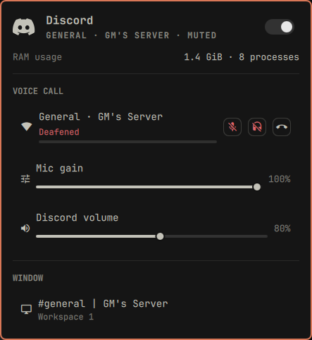
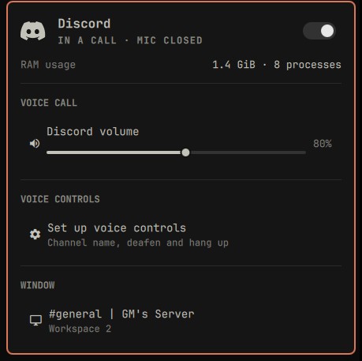

# Discord for the Omarchy bar

A bar widget for the Discord desktop app, built the way the first-party
Dropbox and Tailscale plugins are built: vector icon, keyboard-navigable
panel, and no configuration.

[](https://omarchyplugins.com/plugin.html?id=io.github.thisisgm.discord)
[](https://github.com/thisisgm/omarchy-discord/tags)



The mark is drawn as vector geometry, so it takes the theme's foreground at any
size and sits at the same ink weight as its neighbours:


While you are in a call the icon grows a dot, and that dot turns the theme's
urgent color whenever the call cannot hear you, which is the state above.

## What it tells you

| Question | Answered by | How |
|---|---|---|
| Is Discord installed? | `DesktopEntries` | the shell's own desktop entry index, matched on `StartupWMClass=discord` or `StartupWMClass=vesktop` |
| Does it want you? | Hyprland | the window's urgency flag, which Discord raises on a mention or a DM |
| Where is the window? | Hyprland | `toplevels`, with title and workspace |
| Are you in a call? | PipeWire | Discord's WebRTC voice streams exist only while connected |
| How good is the call? | Discord RPC | `VOICE_CONNECTION_STATUS` ping, drawn as signal strength (optional tier) |
| Can the call hear you? | PipeWire | the capture stream, and whether it is muted |
| What does it cost? | `ps` | resident memory and process count |

Nothing polls Discord's servers, and no account, token, or developer
application is involved.

## Requirements

- **Omarchy Quattro.** This is built against its shell plugin contract.
- **Discord from the Arch `discord` package, or `vesktop`.** Every signal keys
  off the client's shape: window class `discord`, desktop entry
  `discord.desktop` and a process called `Discord`, or the same three slots
  reading `vesktop`. A Flatpak build, another fork, or Discord run as a web app
  publishes different values and is not supported. Making those work is a real
  change with a real test rather than a configuration knob, so the plugin does
  not pretend otherwise.
- **python3**, and only for the optional voice bridge at the bottom of this
  page. Omarchy already ships it.

## Install

```bash
omarchy plugin add https://github.com/thisisgm/omarchy-discord.git --enable
```

Or, from a local checkout:

```bash
cp -r omarchy-discord ~/.config/omarchy/plugins/io.github.thisisgm.discord
omarchy-shell shell rescanPlugins
omarchy plugin enable io.github.thisisgm.discord
```

## Replace Discord's own tray icon

Discord registers a tray item of its own, so out of the box you get two Discord
icons in the bar. Omarchy already solves this for its bundled plugins, since the
tray hides Dropbox's item when the Dropbox widget is loaded, but that list lives
in the shell and takes no plugin hook. So hide Discord's item once by hand:

right-click the tray > **Manage** > untick Discord.

That writes `discord_status_icon_1` into the tray's `hidden` list in
`~/.config/omarchy/shell.json`, and it stays hidden across restarts. Untick it
again if you ever remove this widget.

## Using it

The bar icon dims when Discord is not running, turns the theme's urgent
color when Discord wants your attention, and grows a dot while you are in a
voice call. The dot is urgent-colored whenever the call cannot hear you.

| Input | Does |
|---|---|
| Left click | open the panel |
| Middle click | raise Discord, or start it |
| Right click | mute the call mic, or refresh when not in a call |
| Scroll | Discord's volume |
| `o` / `m` / `d` / `r` | raise / mute mic / deafen / refresh |
| `j` `k`, `Enter` | move and activate; `h` `l` set volume on the volume row |

### Keybindings

The panel is not the only way in. Bind these anywhere:

```bash
omarchy-shell discord raise    # focus the window, or start Discord
omarchy-shell discord mute     # toggle the call microphone
omarchy-shell discord deafen   # toggle deafen (needs the bridge, below)
omarchy-shell discord hangup   # leave the call (needs the bridge, below)
omarchy-shell discord toggle   # the panel
```

`mute` is the interesting one: it works from any workspace without focusing
Discord. Without the optional bridge it mutes Discord's microphone at the
PipeWire level; with it, it presses Discord's own mute button.

Each verb answers `ok`, or says why it did nothing: `no voice bridge`,
`no microphone to mute`, `Discord is not installed`.

## Settings

One, in Setup > Plugins: **hide the icon when Discord is not running**.

## Limits worth knowing

- **Attention needs a window.** Hyprland can only flag a window that exists,
  so an instance closed to the tray reports nothing. The widget shows
  "Running in the background" and can raise it.
- **Mic control needs an open capture stream.** Discord releases the stream
  when it closes the microphone, and there is nothing to mute at the PipeWire
  level until it comes back. The row appears when the stream does.
- **Muting here is not Discord's mute button.** Discord's own UI will still
  show you as unmuted while PipeWire feeds it silence.

Both limits go away with the optional bridge below, which drives Discord's own
mute instead.

## Optional: Discord's own voice controls

Everything above needs no account, token, or setup. Four things cannot be had
that way, because nothing outside Discord knows them: **which** channel you are
in, Discord's own mute and deafen, and hanging up.

Those come from Discord's local RPC socket, and Discord gates it. The socket
refuses any client id that is not a registered application:

```
{"code":4000,"message":"Invalid Client ID"}
```

Client ids are public, so the plugin could ship one, but the `rpc` scope it
needs is approval-gated, and until an app is approved only accounts on its
**App Testers** list may authorize. A shipped client id would therefore work
for the author and for nobody else. There is no anonymous route.

So the bridge is opt-in, and **the plugin is complete without it**. With no
credentials `rpc.py` exits immediately, the panel still knows you are in a call
because PipeWire says so, and the voice section quietly offers to set itself up:



To turn it on, open the panel and use **Set up voice controls**, which takes the
two values inline, no terminal. The same thing from a shell, if you prefer:

```bash
python3 ~/.config/omarchy/plugins/io.github.thisisgm.discord/rpc.py --setup
```

That opens the developer portal, prints the two things to create there, and
takes the **Client ID** and **Client Secret**, both on the application's OAuth2
page with the secret behind *Reset Secret*. It then authorizes against your
running Discord, so you find out it worked before you leave the terminal. It
stores the pair in `~/.config/omarchy-discord/credentials.json` and the token
in `~/.local/state/omarchy-discord/token.json`, both `0600`. The panel writes
those values over stdin, so a secret never appears in a command line or in `ps`.

The **Public Key** on *General Information* is a different value: it verifies
interaction webhook signatures and cannot buy a token. It is 64 hex characters,
and `--setup` rejects it by name if you paste it.

Open the panel afterwards, no restart needed, and it gains the call's name,
deafen, mic gain, and a leave-call row, and the mic row starts driving
Discord's own mute. `--probe` re-checks it any time.

If you are not the application's owner, your account has to be on its **App
Testers** list; the owner is already covered.

## Uninstall

```bash
omarchy plugin remove io.github.thisisgm.discord
rm -rf ~/.config/omarchy-discord ~/.local/state/omarchy-discord
```

Those two directories are the client secret and the token from voice controls, so
they go with the plugin rather than outliving it. Nothing else is left behind except
the tray entry you unticked, if you got that far.

## Contributing

Patches and bug reports are welcome. `CONTRIBUTING.md` has the two-copy layout,
how to test a change against a running shell, and the house rules the code is
held to.

The platform facts this depends on, such as how PipeWire names Discord's
streams and what the RPC handshake refuses, live in `knowledge/` as an
[Open Knowledge Format](https://github.com/GoogleCloudPlatform/knowledge-catalog/blob/main/okf/SPEC.md)
bundle. Every one of them was measured on a running machine, so the next person
does not have to rediscover them.

## Support

If this saved you an afternoon, you can
[buy me a coffee](https://buymeacoffee.com/thisisgm).

## License

MIT.
